# POS — User Manual

For the people who run the store: cashiers, supervisors, managers, and the
operator who installs the system. Covers the register and the back office.

## Revision History

| Version | Date | Changes |
| --- | --- | --- |
| 1.0 | 2026-07-22 | First edition: register, back office, troubleshooting, FAQ, glossary. |

# 1. Introduction

This manual covers everything you need to run the store day to day, and
everything a manager needs to set it up. It's written for four kinds of
reader, and you don't need to read the parts that aren't yours:

- **Cashiers** ring up sales and take payments.
- **Supervisors** do everything a cashier does, plus the actions that let
  money or stock leave the business without a customer noticing — voids,
  discounts, refunds, and approving a drawer that doesn't balance.
- **Managers** (admins) run the back office — the menu, staff, locations, and
  reports.
- **Operators** install and keep the system running.

The chapters are ordered the way the system is actually used: the overview
comes first (Chapters 2–3), then the register — the till a cashier or
supervisor stands at (Chapters 4–7, 14), then the back office a manager signs
into from a laptop (Chapters 8–13). Troubleshooting, an FAQ, and a glossary
sit at the back for when something goes wrong or a term is unfamiliar.

A few conventions hold throughout:

- Anything you tap or click — a button, a tab, a checkbox — appears in
  **bold**, exactly as it reads on screen: **Activate**, **Sign in**, **New
  user**.
- Money amounts are shown in pesos, because every screenshot in this manual
  comes from the same demo store in Manila — the figures and the prose always
  agree on what's on screen.
- **"Till"** means the same thing as **"register"** throughout this manual —
  a physical terminal, not a person. A store has several tills; each one is
  set up once and then used every shift after that.

# 2. System overview

## One order, two ways of selling

Underneath, every sale is the same thing: **open an order, add lines to it,
take money, close it.** The system doesn't run two separate programs for
retail and food service — it runs one order model and lets the till compress
or expand it:

- **Retail** moves through that lifecycle in well under a minute, so the
  till collapses it into a single cart screen: scan, tap **Pay**, done.
- **Food service** lingers in the open phase for an hour or more, so that
  phase gets its own screen — a table, a running tab, courses fired to the
  kitchen — before the till ever asks for money.

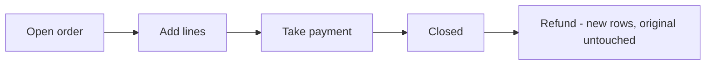

A closed order is never edited. A refund doesn't erase or change the
original sale — it adds new rows on top of it, so the receipt from the day of
the sale still reprints exactly as it did that day, and the refund has its
own paper trail.

Cash accountability follows the same shape, one level up: a till's shift
opens with a counted float, runs sales and cash movements, and closes with
another count.

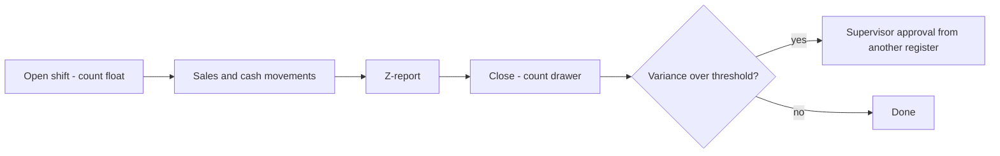

If the counted drawer doesn't match what the system expects within a small
threshold, closing records a **variance** that a supervisor has to approve —
from a *different* till at the same location, never the one that just
closed. Chapter 7 covers why.

## The three surfaces

| Surface | Who uses it | How it signs in |
| --- | --- | --- |
| **Register** | Cashiers and supervisors, at a physical till | An activation code (once, per terminal — exchanged for a device token) plus a staff PIN (every shift) |
| **Back office** | Managers | An email and password — no till involved |
| **API** | The two apps above, and nothing else you should be talking to directly | Whatever the calling app is signed in as |

The register and the back office are separate applications, on separate
screens — a cashier's till never loads back-office code, and a manager's
laptop never needs a device token. Both talk to the same server underneath,
so a sale rung up at the till shows up in the back office's reports
immediately, with nothing to sync or refresh by hand.

## Roles

Three roles cover everything, and they're deliberately coarse:

- **Cashier** — rings up sales, opens and closes their own shift, takes
  payments.
- **Supervisor** — everything a cashier can do, plus voids, discounts,
  refunds, and approving a variance.
- **Admin** — full back-office access: catalog, staff, locations, reports,
  the audit trail.

Cashier and supervisor are assigned **per location** — the same person can be
a cashier at one store and a supervisor at another, and the two never mix.
Admin is different: it's a property of the person, not a role tied to a
location, so an admin is an admin everywhere. There's no in-between tier yet
— you're an admin with full back-office access, or you have none of it.

## Locations and the demo store

Every screenshot in this manual comes from the same seeded demo business —
one company, three locations, all in the Asia/Manila timezone with prices
that already include tax:

| Code | Name |
| --- | --- |
| CAF | Manila Cafe |
| GRC | Manila Grocery |
| RST | Manila Restaurant |

Manila Grocery runs retail (scan and go), Manila Restaurant and Manila Cafe
run food service (tabs and tables). A location owns its own stock, its own
registers, and its own staff assignments — nothing about a role or a stock
count crosses from one location to another.

# 3. Getting started

## Activate a register (once per terminal)

The first time a till is turned on, it shows an **Activate this terminal**
screen and won't go any further until it's given an activation code.

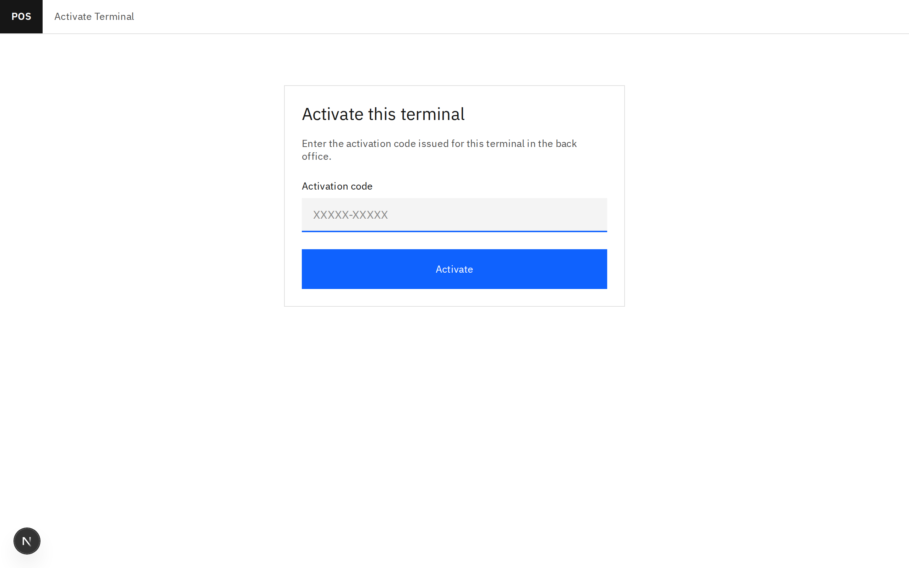

The screen reads **"Enter the activation code issued for this terminal in the
back office."** — a manager issues that code, not the person standing at the
till. See [Issue an activation code](#issue-an-activation-code) in Chapter
11 for how; it also covers a brand-new till's very first code, since there's
no separate "first code" flow.

1. Get an activation code for this specific till from a manager.
2. Type it into **Activation code** (it's shaped like `XXXXX-XXXXX`).
3. Tap **Activate**.

The code is **single-use** and **expires after 7 days** — it's a one-time
credential the till exchanges for its own long-lived device token, not
something typed in more than once. From that point on, the device token,
never the code, is what proves this terminal's identity to the server.

Reissuing a code — for a lost till, or just as routine hygiene — kills the
*old* device token and every staff session bound to it, in the same instant
the new code is created. The old till doesn't get a grace period: it drops
straight to a **Terminal disabled** lockout screen the next time it talks to
the server. Chapter 11 shows that screen (Figure 11.5) and walks through
issuing a fresh code from the back office.

## Clock in with a PIN

Once a till is enrolled, every shift starts the same way: an **Enter PIN**
screen, shown whenever nobody's currently signed in.

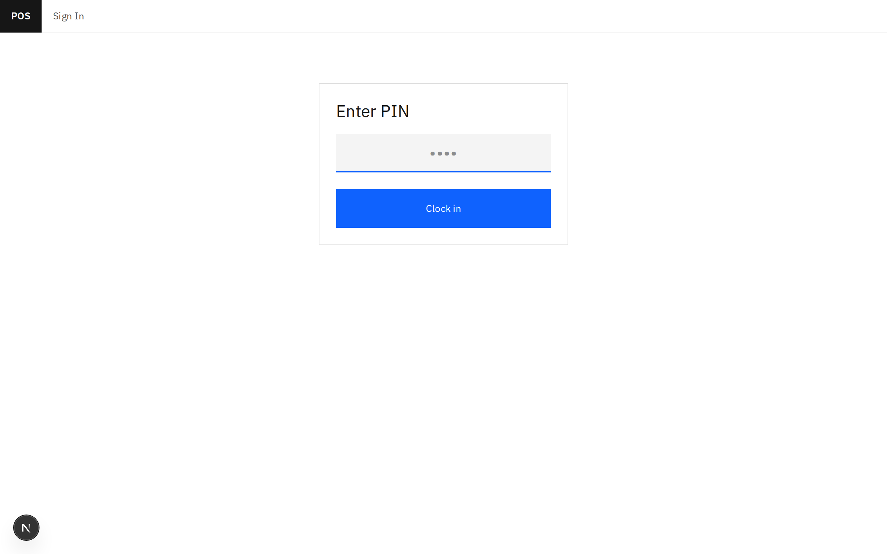

1. Type your 4–6 digit PIN.
2. Tap **Clock in**.

Five wrong PINs in a row locks that till out for 60 seconds. That's
deliberate: PINs are short on purpose, and the lockout is what makes a short
PIN safe to use at all.

## Sign in to the back office

The back office has its own **Sign in** screen — an email and a password,
nothing about a till or a device token involved.

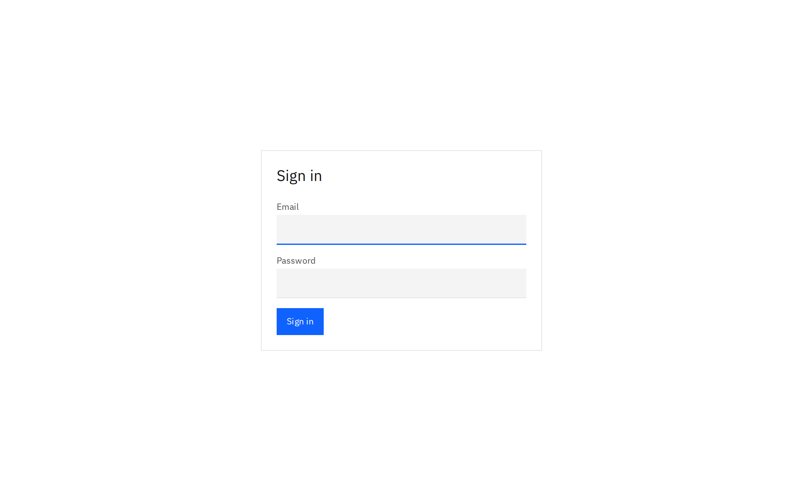

1. Enter your **Email** and **Password**.
2. Tap **Sign in**.

Only admins can sign in here in this version — a wrong email, a wrong
password, a deactivated account, and an account that isn't an admin all
answer with the same message on purpose, so nobody can use the login screen
to probe which email addresses exist in the system.

### Common issues

| Symptom | Cause | Fix |
| --- | --- | --- |
| Activation code rejected | Expired (7 days) or already used | Get a fresh code from the back office (Chapter 11) |
| Till stuck on "Enter PIN", nothing happens | Five wrong PINs in a row | Wait 60 seconds, then try again |
| Back-office sign-in always says "incorrect" | Wrong email/password, account deactivated, or the account isn't an admin | All four cases look identical on purpose; ask another admin to check the account in Chapter 10 |

# 4. The register

*Written in the next revision pass.*

# 5. Retail selling

*Written in the next revision pass.*

# 6. Food service

*Written in the next revision pass.*

# 7. Shifts and cash

*Written in the next revision pass.*

# 8. The back office

## Layout

Everything in the back office sits behind one sign-in. Once you're in, a
rail down the left holds six sections under two headings — **Operations**:
**Today**, **Catalog**, **Users**, **Locations & Registers**; **Insights**:
**Reports**, **Audit**. A **location switcher** sits above the rail, and your
name plus a **Sign out** button sit at the bottom.

**Today**, **Reports**, and the **Stock** report all read whichever location
the switcher is set to — there's no separate location picker on each of
those screens. Change the location once, at the top, and every screen that
cares about it follows along.

## Today

**Today** is what you land on right after signing in — a glance at whichever
location the switcher is set to, right now, with nothing to configure.

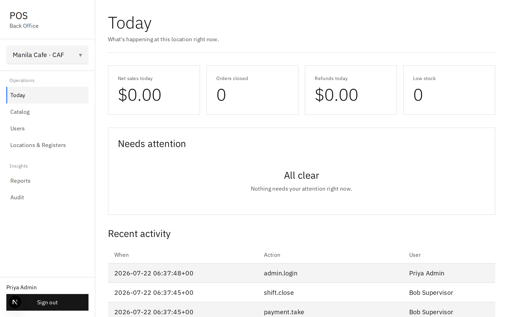

The screen shows:

- A row of four figures — **Net sales today**, **Orders closed**, **Refunds
  today**, and **Low stock** — the same numbers the Sales and Stock reports
  show, just for today and this location.
- **Needs attention** — a table of every low-stock variant and every
  inactive register at this location. Nothing to flag shows **"All clear"**
  instead of an empty table, exactly as it does in the figure above.
- **Recent activity** — the first page of the audit log (When, Action,
  User), trimmed to a glance.

Every number on **Today** already exists somewhere else in the back office —
gathered onto one screen rather than computed specially. If a figure here
ever looks off, the matching report (Reports, Stock, Locations & Registers,
Audit) is where to double-check it.

# 9. Catalog

**Catalog** is where the menu lives — categories, products and their
variants, modifier groups, discounts, and tax rates, each on its own tab.

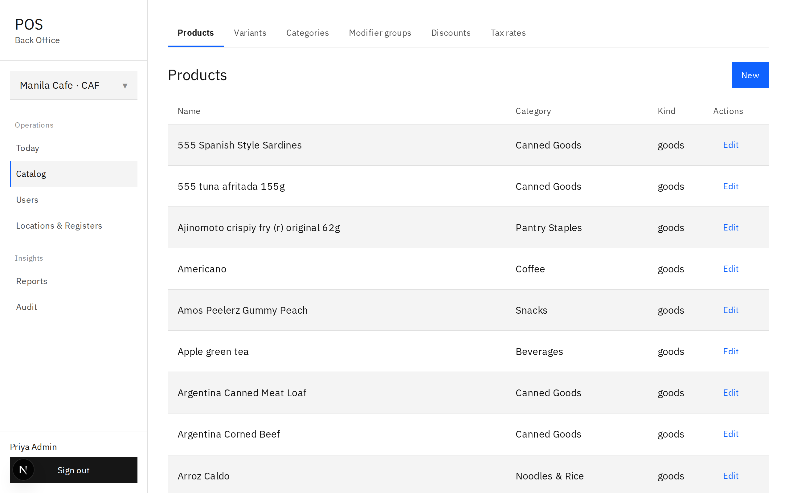

## Products and variants

A **product** is the thing on the menu — a name, a description, a category.
A **variant** is what's actually sold under that product: its own SKU,
barcode, price, cost, and tax rate. Every product needs at least one variant
before it can be rung up at all.

1. In **Catalog**, tap **Products**, then **New**.
2. Fill in **Name**, **Description**, **Category**, and **Kind** (**Goods**
   or **Service**).
3. Tap **Save**.
4. Tap **Variants**, then **New**.
5. Pick the product, then fill in **Name**, **SKU**, **Barcode** (optional),
   **Price**, **Cost** (optional), **Tax rate**, and **Track inventory**.
6. Tap **Save**.

Prices and costs are typed as pesos (e.g. `120.00`) but travel to the server
as cents — a blank or unparseable price is refused before it's ever sent.

## Modifier groups

To attach a modifier group (a coffee's milk, a dish's extras) to a product,
open the product again — a **Modifier groups** panel at the bottom lists
every group as a checkbox.

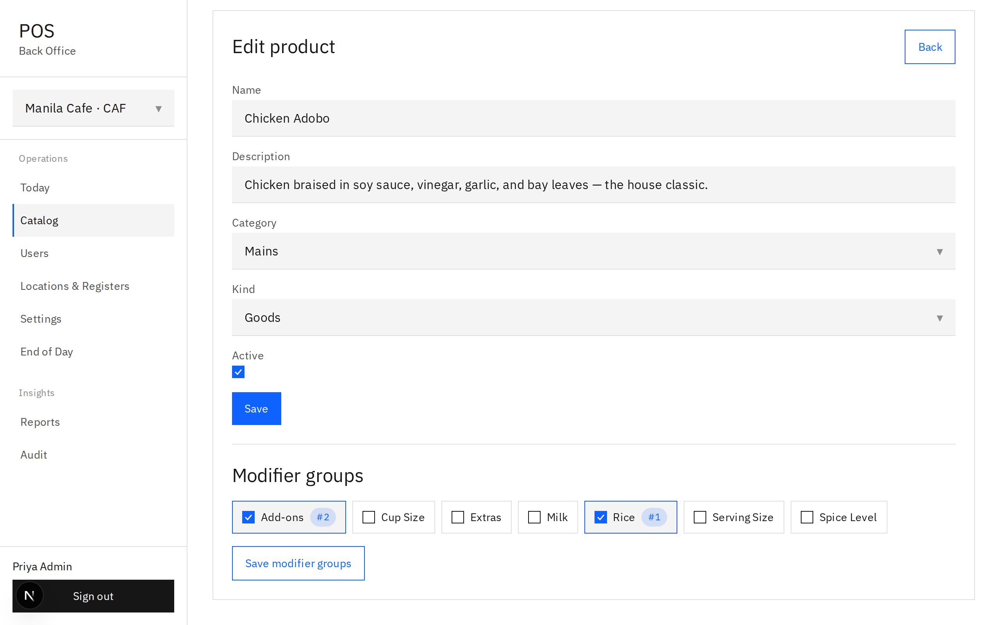

The figure above shows **Chicken Adobo** with **Rice** ticked first (shown
as **#1**) and **Add-ons** ticked second (**#2**) — the order you tick
groups in is recorded against each checkbox. Tapping **Save modifier
groups** is a separate action from the product's own **Save** button above
it, and it's a full replace of the product's attached groups, not an
add-one/remove-one — so an untouched box you meant to keep still has to be
ticked before you save.

Categories and modifier groups themselves have no archive toggle — only
the modifiers inside a group, and the variants inside a product, do. A group
with **Min select** at 1 or more shows up as *required* at the till: the
cashier can't confirm an item until every required group has a pick.

## Discounts and tax rates

**Discounts** (its own tab): **Name**, **Kind** (**Percent** or **Fixed
amount**), the matching value, **Scope** (**Order** or **Line**), **Requires
supervisor**, **Active**.

**Tax rates** (its own tab): **Name**, **Rate (%)** — typed as a percent
(e.g. `12.00`), stored and computed on the server as an exact fraction so
the math never drifts.

## Archive, never delete

There is no delete button anywhere in the back office. Unchecking **Active**
and tapping **Save** on a product, variant, discount, or tax rate **archives**
it instead — it leaves the register's menu, but every past order line,
receipt, and report that points at it keeps working, forever. A confirm
dialog asks first — **"Archive *Name*? It leaves the register catalog but
stays in history."** — and an archived row shows greyed with an **ARCHIVED**
badge and an **Unarchive** button.

### Common issues

| Symptom | Cause | Fix |
| --- | --- | --- |
| I archived an item and it's still on the till | The register's menu caches the catalog for 5 minutes | Normal — wait it out, or scan the barcode instead (a scan always hits the server) |
| A receipt from last month shows the old price after I repriced the variant | Every order line snapshots its price when it's added — receipts never look up the live catalog | Expected behavior, not a bug — see Chapter 12 for how this is proven |
| A new product has no Modifier groups panel | The panel only appears once the product has been saved once (so it has an id) | Save the product first, then open it again |

# 10. Users and roles

## Hire a cashier or a supervisor

1. In **Users**, tap **New user**.
2. Fill in **Name**, and either an **Email**, a **PIN**, or both — one of
   the two is required for a new hire.
3. Leave **Admin** unchecked for regular staff.
4. Under **Roles**, pick a location in **Add location**, pick **Cashier** or
   **Supervisor** in **Add role**, then tap **Add**. Repeat for every
   location this person works at.
5. Tap **Save**.

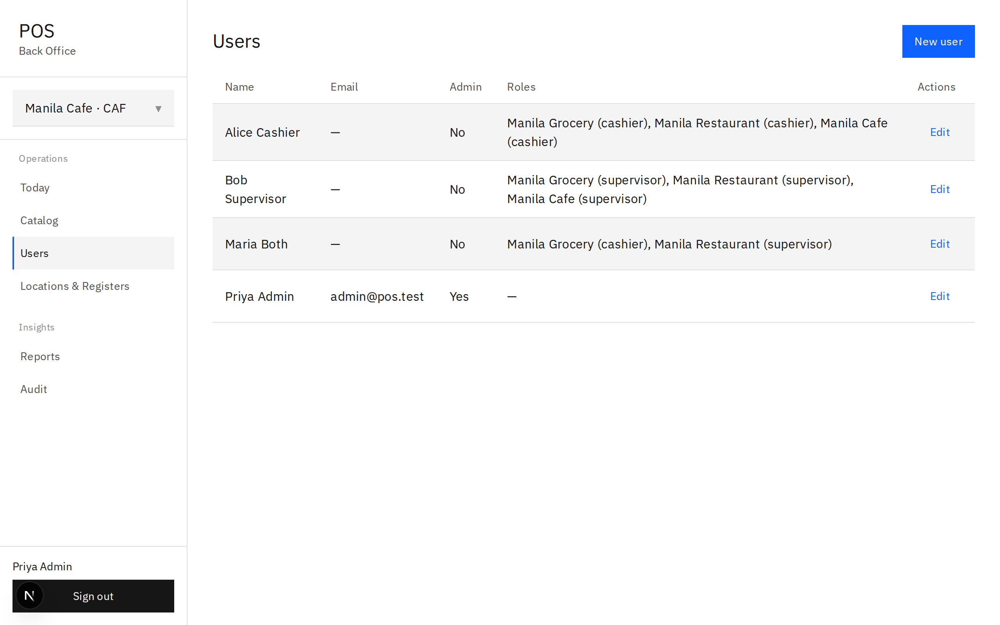

The figure above shows the shape this takes in practice: **Alice Cashier**
holds the cashier role at all three locations, **Bob Supervisor** holds
supervisor at all three, **Maria Both** is a cashier at Manila Grocery and a
supervisor at Manila Restaurant, and **Priya Admin** — the only row with an
email and no location roles at all — is a full admin instead.

Saving the **Roles** table writes the *complete* set of that person's role
assignments in one action, the same way saving modifier groups does in
Chapter 9 — tap **Remove** next to a row to drop a single location
assignment before you save, rather than expecting to edit it after the fact.

## Give someone back-office access

Check **Admin** on their user record and save. There's no in-between tier
yet: admin is full access to **Catalog**, **Users**, **Locations &
Registers**, **Reports**, and **Audit**, or nothing.

## Deactivate a leaver

Open their user record, uncheck **Active**, and tap **Save** — you'll be
asked to confirm: **"Deactivate *Name*? They keep their history but can no
longer sign in."** Their name still shows correctly on every past order,
audit entry, and report they touched; deactivating only blocks a future
sign-in. A **Reactivate** button brings them back later if needed.

## The self-lockout guard

You cannot uncheck your **own** **Admin** box, and you cannot uncheck your
**own** **Active** box. Either one is refused outright, because there's
exactly one admin tier and no fallback above it — if you could lock
yourself out, there might be no one left who could undo it. Have a second
admin make the change if one genuinely needs to leave.

# 11. Locations and registers

## Location settings

**Locations & Registers** → **Locations** tab lists every store: **Code**,
**Name**, **Timezone**, **Prices include tax**, with an **Edit** action.

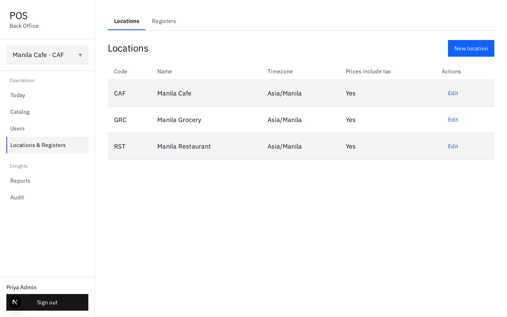

All three of the demo locations shown above — **Manila Cafe**, **Manila
Grocery**, **Manila Restaurant** — run on the `Asia/Manila` timezone with
**Prices include tax** set to **Yes**. Editing a location lets you change
its **Name**, **Code**, **Timezone** (checked against the IANA list),
**Prices include tax**, **Receipt header**, and **Receipt footer**. Flipping
**Prices include tax** only applies to future orders — an order already open
keeps the pricing basis it started with.

A location can be deactivated the same way as everything else in the back
office — uncheck **Active**, confirm, and staff can no longer sign in there,
though its history stays intact.

## Register mode

**Locations & Registers** → **Registers** tab lists every till across every
location, with its **Mode**.

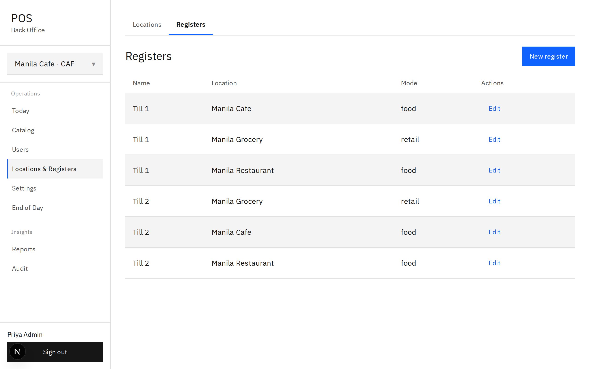

`Till 1` at Manila Grocery runs **retail** — the scan-and-cart screen; every
other till in the figure above runs **food** — the floor-and-menu-grid
screen. Flipping a register's mode is a two-tap edit:

1. **Locations & Registers** → **Registers** → **Edit** on the till.
2. Under **Mode**, tap **Retail** or **Food**.
3. Tap **Save**.

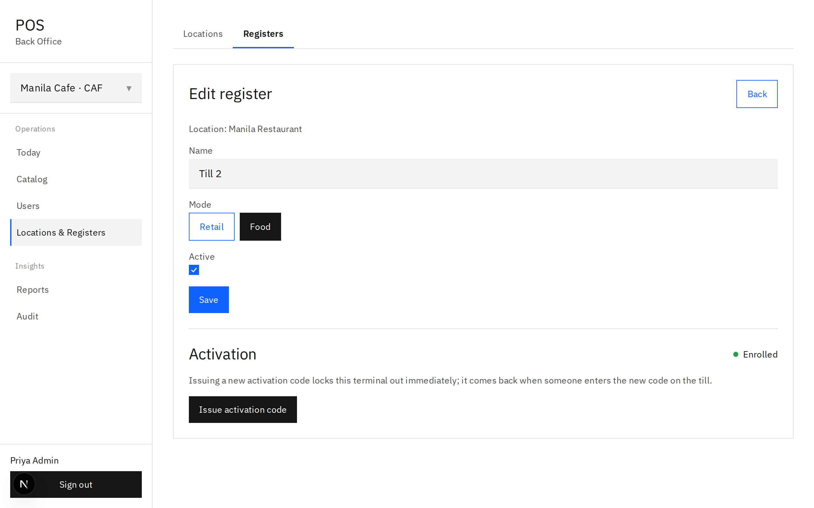

There's no in-between — it's one mode or the other for the whole register,
and it decides which screen that till's app shows the next time someone
signs in there. A register can be deactivated the same way as a location;
**Reactivate** brings it back.

## Issue an activation code

A till proves itself with a device token, but a manager never handles that
token directly — the back office only ever deals in **activation codes**,
which the till itself exchanges for its device token. Every register's
editor shows an **Activation** status pill: **Enrolled**, **Code pending —
expires *date***, **Code expired**, or **Not enrolled** — Figure 11.3 above
shows **Enrolled**.

This is also how a brand-new register goes online for the first time — there
is no separate "first code" screen. **New register** → fill in **Location**,
**Name**, **Mode** → **Save**, then reopen that same till with **Edit** and
follow the steps below, exactly as they apply to replacing a lost or stolen
terminal's code.

1. **Locations & Registers** → **Registers** → **Edit** on the till.
2. Under **Activation**, tap **Issue activation code**.
3. Confirm: **"Issue a new activation code for *Name*? The current till goes
   dark immediately."**
4. The new code appears once, in a copy-me plate.
5. Type the code into the terminal's own **Activate this terminal** screen
   (Chapter 3).

The figure above shows the plate exactly as it appears: **"Activation code —
single use, valid for 7 days. Copy it now, it will not be shown again:"**
followed by the code itself, and the status pill already reading **"Code
pending — expires 2026-07-29"**. Copy it now — closing this screen and it's
gone for good; it's never written anywhere the back office can show again.

Issuing a code revokes the register's current device token *and* every staff
session bound to it, in the same transaction that stores the new code —
there's no window where a lost terminal and its replacement are both live.
The old till drops back to a lockout screen the instant it next tries to
talk to the server:

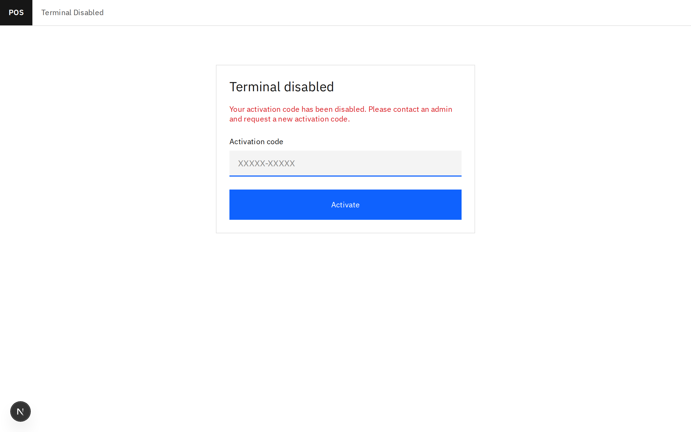

The message reads exactly what it says: **"Your activation code has been
disabled. Please contact an admin and request a new activation code."**,
with the activation-code entry form right below it — so anyone still holding
the old terminal is locked out immediately, not eventually, and can get back
in the moment the new code is typed in. A code that expires unused (7 days)
shows **Code expired** instead — issue a fresh one the same way.

# 12. Reports

## Sales

**Reports** → **Sales** tab: pick a **From**/**To** date range, then a
group-by tab — **Day**, **Category**, or **User**. The location comes from
the sidebar's location switcher.

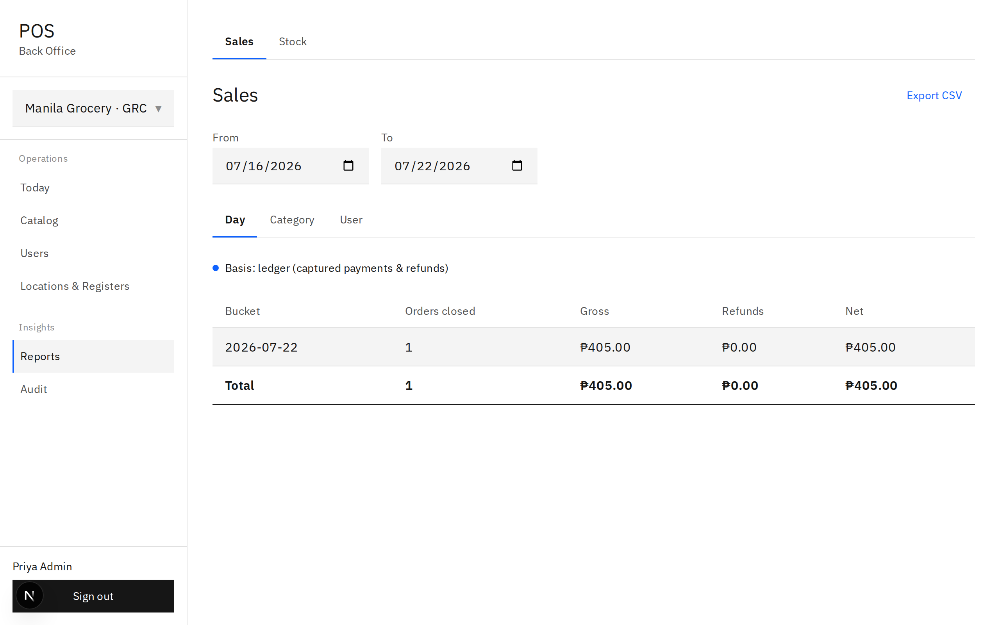

**Day** and **User** are **ledger-basis** — summed from actual payments and
refunds that moved money, with columns **Orders closed**, **Gross**,
**Refunds**, **Net**. The figure above shows exactly one order closed on
2026-07-22 at Manila Grocery: **₱405.00** gross, **₱0.00** refunded,
**₱405.00** net.

**Category** is **line-basis** instead — summed from order lines, joined to
*current* category names, with columns **Qty sold** and **Line total**.

These two bases are **not required to reconcile**, and that's by design, not
a bug to chase down. A payment covers a whole order at once; a category
breakdown has to attribute individual lines. They're answering different
questions — "how much cash and card came in" versus "what sold" — so don't
expect the Day total and the sum of the Category totals to match to the
cent.

Tap **Export CSV** on the **Sales** tab to download the report exactly as
displayed, with money figures as plain decimal strings rather than
currency-formatted text.

## Stock

**Reports** → **Stock** tab: tap **Low only** to filter down to items
running short. The table shows **SKU**, **Name**, **Qty** — a row under
threshold is highlighted and marked **— LOW**.

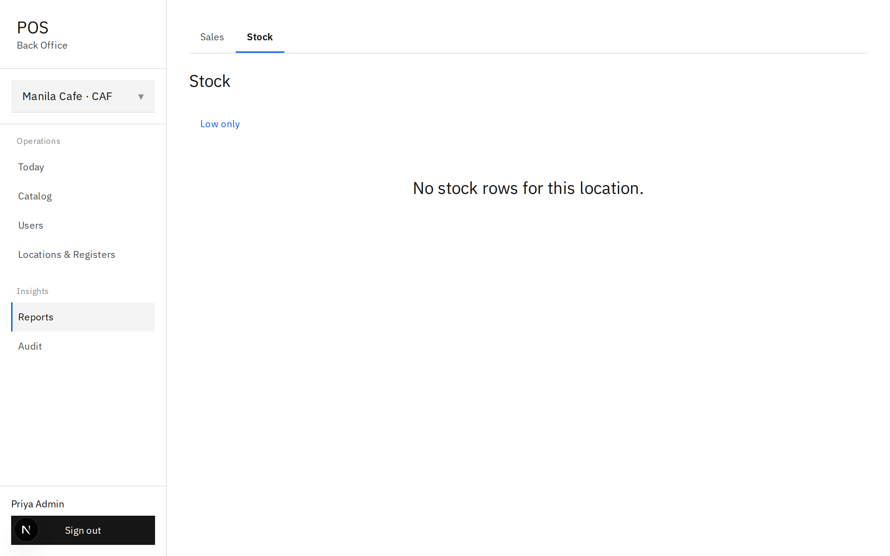

# 13. Audit log

**Audit** shows every write anywhere in the system — the register and the
back office alike — one row per change: **When**, **Action**, **Entity**,
**User**, **Register**, **Payload**.

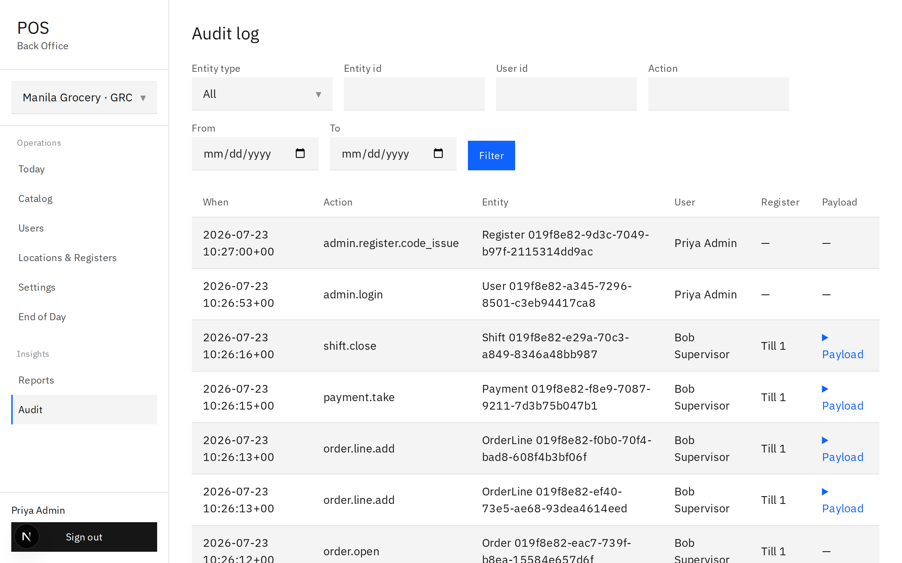

The figure above shows what a shift's worth of activity looks like end to
end: a manager issuing an activation code (`admin.register.code_issue`) and
signing in (`admin.login`), then a supervisor's till closing a shift
(`shift.close`), taking a payment (`payment.take`), adding order lines
(`order.line.add`), and opening the order in the first place (`order.open`)
— each one tagged with the till it came from where one was involved.

1. Narrow down with **Entity type** (a dropdown of every recorded kind —
   Order, Payment, Refund, User, Product, and so on), **Entity id**, **User
   id**, **Action**, and a **From**/**To** date range.
2. Tap **Filter** to apply them.
3. Tap **Load more** to bring in the next page (50 rows at a time) without
   losing the rows already on screen.

Each row's **Payload** column, where there is one, is collapsed behind a
disclosure — tap it to see the raw JSON of what changed. A reprice, for
instance, logs the variant's price both **from** and **to**, so "who changed
this and what was it before" is always answerable without asking anyone to
remember.

This is where a store owner finds out who did what — a repriced variant
shows up as `admin.variant.update`, an activation-code issue as
`admin.register.code_issue`, a new product as `admin.product.create`, and so
on for every entity in the system — not a separate history screen per
entity.

# 14. The desktop shell and printing

*Written in the next revision pass.*
